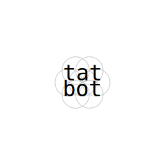
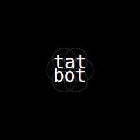

<!-- 

  <a href="https://tatbot.ai/">
    <picture>
      <source media="(prefers-color-scheme: dark)" srcset="docs/img/tatbot-dark.svg">
      
    </picture>
  </a>

  <em>tatbot</em>

  

---

--- -->
# tatbot