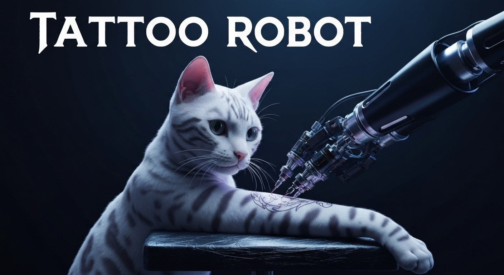

<div align="center">
  <a href="https://tatbot.ai/">
    <picture>
      <source media="(prefers-color-scheme: dark)" srcset="docs/logos/dark.svg">
      
    </picture>
  </a>
</div>
<div align="center">
  <a href="https://github.com/hu-po/tatbot/blob/main/LICENSE"></a>
  <a href="https://hu-po.github.io/tatbot/"></a>
  <a href="https://poly.cam/capture/ad7c1544-fca2-48d8-acf8-a94d328fc5c4" target="_blank" rel="noopener noreferrer">
    
  </a>
  <a href="https://huggingface.co/tatbot/datasets">
    
  </a>
  <br>
  <a href="https://x.com/tatbots">
    
  </a>
  <a href="https://www.tiktok.com/@tatbottok">
    
  </a>
  <a href="https://www.instagram.com/tatbots/">
    
  </a>
</div>

# **tatbot**: tattoo robot

🙋‍♂️ Want a tattoo? Join the [waitlist](https://forms.gle/Zys6f5iLEtYCG8VW7)

🚀 Follow the [progress](docs/progress.md)

📚 Read the [documentation](https://hu-po.github.io/tatbot/)

🎥 Watch the [livestream](https://youtube.com/live/ym27ZHPMaec)

[](https://youtube.com/live/ym27ZHPMaec)

## Citation

```
@misc{tatbot-2025,
  title={tatbot},
  author={Hugo Ponte},
  year={2025},
  url={https://github.com/hu-po/tatbot}
}
```