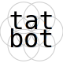

<div align="center">
  <a href="https://tatbot.ai/">
    <picture>
      <source media="(prefers-color-scheme: dark)" srcset="assets/logos/dark.svg">
      
    </picture>
  </a>
</div>
<div align="center">
  <a href="https://x.com/tatbots">
    
  </a>
  <a href="https://github.com/hu-po/tatbot/blob/main/LICENSE"></a>
  <a href="https://www.tiktok.com/@tatbottok">
    
  </a>
  <a href="https://www.instagram.com/tatbots/">
    
  </a>
<iframe src="https://poly.cam/capture/548778f3-e243-41bd-87b8-6ed2d5dfff5a/embed" title="Polycam capture viewer" style="height:100%;width:100%;max-height:720px;max-width:1280px;min-height:280px;min-width:280px" frameborder="0"></iframe>
</div>

# **tatbot**: tattoo robot

Understand the [tech](docs/tech.md). Follow the [plan](docs/plan.md). Read the [paper](docs/paper).

## Citation

```
@misc{tatbot-2025,
  title={tatbot},
  author={Hugo Ponte},
  year={2025},
  url={https://github.com/hu-po/tatbot}
}
```