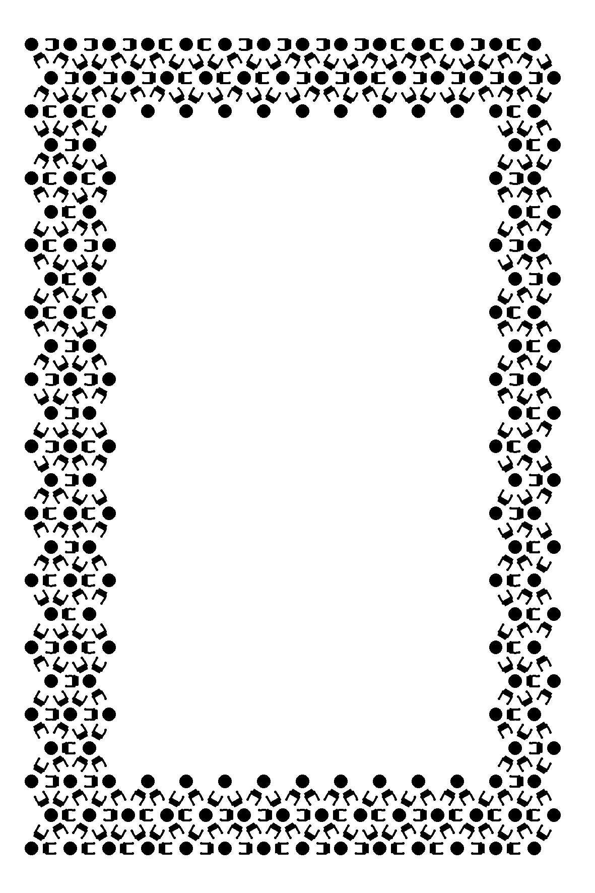

# Seeded stencil frames

`tatbot vision stencil generate` creates a black-and-white stencil frame around
a clear centre for the tattoo. The default design is the **coded
flower-of-life** (`--design coded-flower-of-life`,
[`scripts/lib/stencil_coded.py`](../scripts/lib/stencil_coded.py)). It keeps
the flower-of-life hex lattice and codes it:

- **Beads.** A solid round bead sits on every lattice junction, with a clear
  halo between it and the petal arcs, so it stays an isolated blob after the
  transfer spreads.
- **Teardrop bits.** Every lattice edge carries both of its petal arcs. A
  filled teardrop at one end of the petal or the other is that edge's bit.
  A washed-off edge reads as an erasure, not as the other bit.
- **The print ID is the code.** The print ID seeds every bit. A deterministic
  search then makes every local window of edges differ from every other, under
  all lattice rotations and reflections. The whole frame is the print code, so
  there is no separate print-ID grid.

A coded tracker decodes the print and its page position from any
sufficiently large patch of the frame; [stencil bench](stencil-bench.md)
describes the decoder and scores it on synthetic transfers. The legacy seeded
floral frame is still available as `--design flower-of-life`
([below](#legacy-flower-of-life)).

## Three coded prints

These are the first coded pages printed for testing: seeds 1, 2 and 3 with the
default settings. Each has a **100 × 150 mm** page, a **5 mm** white outer
margin, a **14 mm** coded border and a nominal **62 × 112 mm** clear centre.
The PNGs are 1181 × 1772 pixels at 300 DPI, solid black on white.

| Seed | Print ID | Phone-app image | Scalable artwork | Settings | Tracking manifest | Code |
| --- | --- | --- | --- | --- | --- | --- |
| `1` | `e1904cce0514…` | [PNG](assets/stencil-coded/1/stencil.png) | [SVG](assets/stencil-coded/1/stencil.svg) | [settings.json](assets/stencil-coded/1/settings.json) | [tracking.json](assets/stencil-coded/1/tracking.json) | [coded.json](assets/stencil-coded/1/coded.json) |
| `2` | `e41ac0293231…` | [PNG](assets/stencil-coded/2/stencil.png) | [SVG](assets/stencil-coded/2/stencil.svg) | [settings.json](assets/stencil-coded/2/settings.json) | [tracking.json](assets/stencil-coded/2/tracking.json) | [coded.json](assets/stencil-coded/2/coded.json) |
| `3` | `1173b01276fe…` | [PNG](assets/stencil-coded/3/stencil.png) | [SVG](assets/stencil-coded/3/stencil.svg) | [settings.json](assets/stencil-coded/3/settings.json) | [tracking.json](assets/stencil-coded/3/tracking.json) | [coded.json](assets/stencil-coded/3/coded.json) |



Import a PNG into the stencil phone app and set the **whole image** to
100 × 150 mm, or use the [print sheets](#print-sheets-rulers-and-label), which
add rulers and a label. Check the printed dimensions, because an app may ignore
DPI metadata or crop the white margin. Keep a reference that matches the
actual transferred orientation if the app or printer mirrors it. Resizing the
page also scales the border, clear centre and stroke widths.

## Generate

Prerequisites: `uv`. The CLI runs the generator with Python 3.12,
`numpy==2.5.3` and `Pillow==12.1.1` in a managed environment; the first run
may download them. Help, schema, validation and dry-run work from the
stdlib-only CLI.

```sh
# The coded default design: the seed names the print and derives its print ID.
scripts/tatbot vision stencil generate --seed 1 --output ~/tatbot-logs/stencils/coded-1

# Without --seed a fresh seed is minted, so every ordinary print is distinct.
scripts/tatbot vision stencil generate --output ~/tatbot-logs/stencils/next

# Coded settings.
scripts/tatbot vision stencil generate --seed 101 --set knot_mm=2.4 --set bit=seed \
  --output ~/tatbot-logs/stencils/coded-101-seed-bits

# The legacy floral frame.
scripts/tatbot vision stencil generate --design flower-of-life --seed tatbot-42 \
  --output ~/tatbot-logs/stencils/tatbot-42
```

The artwork goes directly into `--output`: `stencil.png`, `stencil.svg`,
`settings.json`, `tracking.json` and, for a coded print, `coded.json` (the
lattice, bits, style and window margins). Existing files with those names are
replaced. Print sheets go into `print/` (see
[below](#print-sheets-rulers-and-label)); `--no-sheets` skips them. The command
prints one JSON object with the design, seed, output directory, pattern ID,
print ID, tracking manifest and sheet manifest.

The same design, seed and settings reproduce the artwork: `--seed 1`
regenerates the seed-1 example byte for byte. A minted seed is 12 hex digits.
It is recorded in `settings.json`; the sheet label prints the pattern ID,
which names the artwork's `tracking.json`, so a page can be traced and
reprinted.

### Coded settings

The coded design takes `--set key=value`, repeatable; a `-` in a key reads as
`_`. An unknown key is refused. The defaults are the bead-and-teardrop design
chosen in the style search; [stencil bench](stencil-bench.md) describes the
style axes and how each design scores.

| Key | Default | Meaning |
| --- | --- | --- |
| `width_mm`, `height_mm` | `100`, `150` | Whole page dimensions |
| `margin_mm` | `5` | White margin outside the frame |
| `frame_mm` | `14` | Coded border width on each side; at least one lattice spacing |
| `spacing_mm` | `6.5` | Lattice spacing and petal radius; at least 3 mm |
| `stroke_mm` | `0.3` | Arc line width; at most a sixth of the spacing |
| `knot_mm` | `2.2` | Bead diameter |
| `halo_mm` | `1.5` | Clear gap between a bead and the arcs that meet it |
| `bit` | `teardrop` | `teardrop`, `seed` (a dot on the petal) or `side` (one arc per edge; its bulge side is the bit) |
| `arcs` | `full` | `full` (both petal arcs) or `single`; follows `bit` unless set |
| `teardrop_from`, `teardrop_to` | `0.3`, `0.45` | The teardrop's stretch of the petal, as fractions of the chord from its end |
| `seed_at` | `0.36` | The seed dot's position along the chord |
| `knot` | `disk` | `disk`, `ring` or `dot-ring` |
| `ornament`, `ornament_rate` | `none`, `0.6` | Uncoded decoration at triangle centres (`none`, `dots` or `rings`) and its rate |
| `window_radius` | `3` | Lattice steps in a code window, 1-3 |
| `optimize_rounds` | `200` | Rounds of the window-distance search |
| `dpi` | `300` | PNG resolution; the SVG stays scalable |

### Clear centre

The nominal clear centre is `(width − 2 × (margin + frame))` by
`(height − 2 × (margin + frame))` millimetres, 62 × 112 mm by default. The
generator rejects dimensions that leave no centre. Coded beads sit centred on
the lattice junctions, so they reach up to about 0.9 mm into the nominal clear
centre, unevenly between sides. `settings.json` records each side's innermost
ink as `border_inner_mm` (`[x0, y0, x1, y1]` in page mm, `[19.473, 19.812,
82.211, 130.133]` for the examples); the lattice layout depends on the page
and lattice settings, not on the seed. Narrower borders leave more room for
the tattoo. Smaller beads or thinner lines can disappear during transfer;
check the print before relying on it for tracking.

### Half-skin pages

A 185 × 140 mm silicone practice skin cut across its long side gives two
92.5 × 140 mm pieces. An **83 × 127 mm** page fits one with its whole print
sheet (91 × 137 mm, rulers and label included), so each half of a skin
carries its own print:

```sh
scripts/tatbot vision stencil generate --seed <seed> --set width_mm=83 --set height_mm=127 \
  --output ~/tatbot-logs/stencils/<name>
```

Its clear centre is 45 × 89 mm and its border is 19.6–19.9 mm deep on every
side. Its code windows differ by at least 8 bits, against 7 on the
100 × 150 mm page. Choose a page size by the lattice. Rows are 5.63 mm apart,
and one phase serves both bands, so some sizes leave a band a row short:
84 × 128 mm has two rows along its top and 285 coded edges against 310.
Check `coded_edges` and `border_inner_mm` in `settings.json` before printing
a new size.

Generation, print sheets, the stencil observer and the drawing stack take
any page size. Install the print's reference (`vision stencil reference
--settings <artwork>/settings.json --install`, which also installs the
`settings.json`) on the camera node and name it when the stack starts, by the
hex digits its sheet prints:

```sh
scripts/tatbot ros up --hardware real --estop udp --page stencil --arms right --probe --pattern 71f05c95e635
scripts/tatbot ros compile artwork.json --stencil ~/tatbot-logs/stencils/<name> -o prepared
```

The stack reads the page's size, clear centre and inner border edges from the
installed print; `--stencil` checks the design against the same print when it
is prepared, and a draw whose lines leave that clear centre is refused before
the arm moves.

### Legacy flower-of-life

`--design flower-of-life` is the earlier seeded floral frame
([`scripts/lib/stencil_frame.py`](../scripts/lib/stencil_frame.py)). Seeded
gaps, filled petals, rings and dot clusters vary the intersecting-circle
border from place to place. The floral artwork is a texture, not a code.
Ordinary generation mints a fresh 96-bit print ID and co-prints its code in
the top frame. The design takes its own options, and the coded design refuses
them; `--set` is refused with this design.

| Option | Default | Meaning |
| --- | --- | --- |
| `--seed` | `tatbot-42` | Any text or number; selects the border variations |
| `--width-mm`, `--height-mm` | `100`, `150` | Whole page dimensions |
| `--margin-mm` | `5` | White margin outside the frame |
| `--frame-mm` | `14` | Width of the patterned border on each side |
| `--spacing-mm` | `7` | Circle radius and lattice spacing |
| `--stroke-mm` | `0.45` | Line width before raster rounding |
| `--gap-rate` | `0.22` | Fraction of circle sectors omitted |
| `--fill-rate` | `0.14` | Probability of filling a candidate petal |
| `--dpi` | `300` | PNG resolution; SVG remains scalable |
| `--instance-id` | fresh random ID | Explicit 24-digit lowercase hex ID for a reproducible printed file |
| `--unmarked` | off | Legacy artwork without a physical print code; identity remains unqualified |

The three checked-in legacy examples predate the instance code. Add
`--unmarked` to reproduce their PNG and SVG artwork; those prints cannot be
uniquely identified by the observer.

| Seed | Phone-app image | Scalable artwork | Settings and hashes |
| --- | --- | --- | --- |
| `tatbot-42` | [PNG](assets/stencil-frames/tatbot-42/stencil.png) | [SVG](assets/stencil-frames/tatbot-42/stencil.svg) | [JSON](assets/stencil-frames/tatbot-42/settings.json) |
| `tatbot-43` | [PNG](assets/stencil-frames/tatbot-43/stencil.png) | [SVG](assets/stencil-frames/tatbot-43/stencil.svg) | [JSON](assets/stencil-frames/tatbot-43/settings.json) |
| `tatbot-44` | [PNG](assets/stencil-frames/tatbot-44/stencil.png) | [SVG](assets/stencil-frames/tatbot-44/stencil.svg) | [JSON](assets/stencil-frames/tatbot-44/settings.json) |

```sh
scripts/tatbot vision stencil generate --design flower-of-life --seed tatbot-43 --unmarked \
  --output ~/tatbot-logs/stencils/tatbot-43
```

## Print sheets: rulers and label

A print sheet wraps a stencil page with:

- a **millimetre ruler down the left edge**, reading 0 at the page's top edge
  and running its full height, and a **millimetre ruler along the bottom
  edge**, reading 0 at its left edge and running its full width, for
  checking the scale of the print and of its transfer on skin both ways;
- **one small line centred over the top edge**: the pattern ID's first 12 hex digits
  and the page size, such as `pattern 644a8a0efdf7   83 x 127 mm`.

All three sit outside the stencil page, in strips 8 mm (left), 4 mm (top) and
6 mm (bottom) wide, so the page coordinates in `tracking.json` are unchanged;
`print/sheet.json` records the page's offset on the sheet.

`vision stencil generate` writes the sheets into `<output>/print/`, at 300 DPI.
`tatbot vision stencil print` writes them for existing artwork (`--artwork`,
with `--dpi` for another resolution), or with `--seed` first generates a coded
stencil into `<output>/artwork/` (the default design, or `--set key=value`
settings):

```bash
tatbot vision stencil generate --seed 101 --output ~/tatbot-logs/stencils/coded-101   # artwork and print/
tatbot vision stencil print --seed 101 --output ~/tatbot-logs/stencils/coded-101      # artwork/ and print/
tatbot vision stencil print --artwork docs/assets/stencil-coded/1 --output /tmp/coded-1-print
```

In `print/`:

- **`stencil-app.png`**: black and white, 300 DPI, for a thermal stencil
  printer's phone app. Set the **whole image** to `sheet_mm` in `sheet.json`
  (108 × 160 mm for a 100 × 150 mm page, 91 × 137 mm for 83 × 127), and do
  not crop the white edges.
- **`paper-a4.pdf`** and **`paper-letter.pdf`**: the sheet at 100 %, centred
  on a paper page. Print at actual size, with no fit-to-page.
- **`paper-fit.pdf`** (with `--fit-area WxH`, on either command): the page is
  exactly a printer's printable area. Some driverless (IPP Everywhere)
  printers ignore a no-scaling request and stretch whatever page they get, up
  or down, to fill their printable area. Given a page of exactly that area,
  the stretch is 1. Example: a Canon TR4700 reports margins of 6.4 / 6.3 mm
  left / right and 5 mm top / bottom on Letter, so the area is
  `--fit-area 203.2x269.4`. An area smaller than the sheet is refused.
- **`sheet.svg`**: the same sheet in millimetres.
- **`sheet.json`**: geometry, source hashes and print instructions.

After printing, check both rulers against a real ruler (150 mm down the side
and 100 mm along the bottom for the default page). The rulers and label
transfer onto skin with the stencil; in a photo they give the scale, and
mirrored label text shows a mirrored transfer.

## Reproducibility and tracking scope

The coded design is [`scripts/lib/stencil_coded.py`](../scripts/lib/stencil_coded.py).
Its bits come from a SHA-256 stream seeded by the print ID
(`sha256("tatbot-coded-print:<seed>")`, 24 hex digits), then a deterministic
search raises the worst window's distance; the same seed and settings
reproduce the artwork, its `coded.json` and its pattern ID. The code is the
print's identity: two prints with different seeds differ in their bits
everywhere on the frame, and a decode names the print. Reprinting one seed
gives identical codes that cannot be told apart, as for any copied file.
`settings.json` records the generator and Pillow versions, the settings, the
window margins the code achieved, and SHA-256 hashes of the PNG, SVG and
`coded.json`.

The legacy design is [`scripts/lib/stencil_frame.py`](../scripts/lib/stencil_frame.py).
A SHA-256 counter stream supplies all floral-artwork choices. A fresh random
print ID makes each ordinary output file distinct; pass `--instance-id` to
reproduce the same marked file, or `--unmarked` for a legacy example. There is no image model
or network generation. Keep the code and settings alongside
the image. The settings record generator and Pillow versions, physical and pixel
dimensions, coverage, and SHA-256 hashes of the PNG and SVG. PNG file bytes can
vary with the rendering environment even when decoded pixels agree.

The legacy circle scaffold is periodic; arc omissions and decorations vary
across it. That floral artwork is not a fiducial with guaranteed unique local
descriptors.
The top-frame grid carries a 96-bit print ID and CRC; it is read only after
the page homography is found, not used as a robot-frame registration marker.
It does not register itself in the [fiducial inventory](fiducials.md),
establish metric scale from the seed alone, or configure Tatbot's surface mapper.
The blank center preserves the view of the tattoo but adds no texture there for
measuring local deformation. Validate feature matching on the actual transferred
surface before treating the frame as tracking evidence.

## Reference acquisition and image tracking

The generator also writes `tracking.json`. Existing artwork can acquire this
manifest without being regenerated:

```sh
scripts/tatbot vision stencil reference --settings stencil/settings.json
```

`--install` also copies the manifest, its artwork and the generator's
`settings.json` (the drawing stack's page geometry) under this node's log
root (`stencils/references/<pattern_id>/`), where the fleet stencil observer
(`stencild`, see [vision](vision.md)) reads its references: it rescans them by
mtime, so an installed print is observed on the next turn and no service
restarts. The image and a coded print's `coded.json` land before the
manifest, each atomically, so the observer never pairs a manifest with files
it does not describe.

A coded print's manifest binds its code: a `coded` block names `coded.json`
with its SHA-256, scheme and print ID, and the print ID is the reference's
`physical_instance_id`. A coded reference loads only beside the `coded.json`
it was exported with; a changed, missing or foreign code is refused, and a
coded print is never tracked by its appearance. A coded manifest exported
before the code was bound is refused with the command that re-exports it:
`vision stencil reference --settings <artwork>/settings.json` binds the
`coded.json` beside the artwork when its print ID, geometry and lattice size
match the settings.

The manifest binds the artwork-only pattern identity, exact marked raster hash,
expected print ID and grid geometry when marked, requested print
dimensions, and page UV coordinates. UV starts at the whole page's top left;
`u` increases rightward and `v` downward. Pixel centers map as
`((x + 0.5) / width, (y + 0.5) / height)`. Print dimensions are nominal until
measured. A pattern ID identifies floral artwork; two marked files can have the
same pattern ID but different reference and print IDs. Reprinting or copying
one marked file gives identical codes and remains indistinguishable.

A coded print is found by decoding it
([`stencil_coded_live.py`](../scripts/vision/stencil_coded_live.py), decoder in
[stencil bench](stencil-bench.md)). The decode names the print and gives each
junction's page UV and pixel; those correspondences pass the same homography,
coverage and page gates as a SIFT acquisition, with a reprojection gate scaled
to the decoded lattice, and seed the same Lucas–Kanade track. On every later
frame the tracker re-reads the print's own bits between the tracked junctions
and compares them with the code: a lattice slip, flow onto another print, or
unreadable bits read as lost. A rejected or ambiguous decode is lost, never a
pose. In replay, `--region X0,Y0,X1,Y1` bounds the decode to a pixel box of a
large frame; small frames are searched whole.

The image observer searches legacy references using SIFT at three
scales in both transfer orientations. The `--all-references` scene mode uses
seven scales (100–640 pixel long edges) and a larger image feature budget to
acquire smaller stencils in a shared view. Images above 2.5 million pixels are
halved until they fit that acquisition budget, reducing competition from fine
background texture. Features map back to native pixel centers before matching
geometry, optical flow and depth lookup; pixel-error gates are unchanged.
Ratio-filtered descriptor matches must
pass distinct-location, RANSAC, coverage, and nondegenerate page checks. Close
competing pattern scores produce an ambiguous result. Acquired correspondences
seed the existing forward/backward Lucas–Kanade tracker, with reference
verification every 1.5 seconds and new searches at most every 250 ms.

```sh
scripts/tatbot vision stencil replay \
  --reference docs/assets/stencil-frames/tatbot-43/tracking.json \
  --instance skin-a --frames frames.jsonl \
  --output ~/tatbot-logs/stencil-replay/example

# Run on the camera owner with its existing frame socket and exact RGB name.
scripts/tatbot vision stencil observe \
  --reference docs/assets/stencil-frames/tatbot-43/tracking.json \
  --instance skin-a --socket /tmp/visiond.sock --sensor wrist_color \
  --duration-s 30 --max-frames 300 \
  --output ~/tatbot-logs/stencil-observe/example
```

Repeat `--reference` to include competing patterns, or add `--all-references`
to track one independent instance of **each distinct pattern**:

```sh
scripts/tatbot vision stencil replay --all-references --surface \
  --reference stencil-a/tracking.json --reference stencil-b/tracking.json \
  --instance session-a --frames frames.jsonl \
  --output ~/tatbot-logs/stencil-replay/two-stencils
```

In scene mode, spatially disjoint matches can both succeed. Competing matches
whose observed feature hulls substantially overlap are rejected or marked
ambiguous according to their support. Each pattern has independent loss,
reference verification, and recovery. Its instance ID is the supplied namespace
plus the full pattern ID. Reference search is shared across trackers that need
it on the same frame. One reference per artwork pattern is still supported.
A different, readable print code on the same artwork is refused even if its
replacement was not jointly visible with the original. Simultaneous copies of
one pattern, or two copies printed from the same marked file, remain outside
that guarantee.

Output must be a new
directory outside the checkout. Dependencies are pinned by the CLI; first use
may download them. Live observation subscribes to an existing frame owner and
does not open a camera backend. Replay accepts a native, hash-checked visiond
sensor index through `--recording frames.jsonl`, or `--frames` with JSONL rows:

```json
{"image":"frame.png","timestamp_ns":1000000000,"source_id":"wrist-session-a"}
```

Generic image paths are relative to the manifest or absolute. An optional
`depth_m` path names an aligned floating-point NPY plane in meters. Timestamps
must be from one normalized clock domain; preserve capture gaps. Source/profile
changes and gaps over 500 ms discard optical-flow continuity and require new
reference acquisition. Non-increasing timestamps withhold coordinates.

Each observation distinguishes image correspondence from geometry validity.
On loss it emits no homography or landmarks. Reacquisition uses the original
reference coordinates and cannot silently change the initially acquired pattern.
The `--instance` label is operator supplied. For marked references, each
current image must also decode the expected code; missing, low-resolution,
ambiguous or different codes withhold image tracking and measured pose. Old
unmarked references can still track artwork but explicitly report
`physical_instance_identity_verified: false`. Neither the mark nor this
observer output alone authorizes motion. Without `--all-references`, the original single-instance
behavior remains: the first acquired pattern stays locked through recovery.

`observations.jsonl`, `report.json`, retained references, and a final overlay
record the result. Processing percentiles exclude capture, transport, and
reference-bank initialization. Cold acquisition costs more than optical flow;
measure both on the intended camera owner. Live frames use a bounded latest-only
queue. Reported capture age does not certify clock agreement or control freshness.
Optional `--truth` labels are read only after tracking; one label per observation
contains `visible`, `pattern_id`, and optionally `homography_uv_to_image` for
pixel-error scoring. Evaluation reports false accepts, missed frames, and return
recovery delays. Scene labels contain a `stencils` list with one label for every
supplied pattern on each frame. Synthetic tests cannot establish hardware surface
accuracy.

## Live prints

The fleet stencil observer (`stencild`, see [vision](vision.md)) watches every
installed print continuously: install a reference with
`vision stencil reference --settings … --install` and its pose is published as
`tatbot.target-pose/1` on `tatbot/tracking/target/<pattern_id>` on the next
turn, with the `support` it rests on; the fleet Rerun viewer draws each print's
outline at `world/tracking/target/<pattern_id>`, a covered print clears its
outline while its status stays. No robot workflow and no separate preview
process is needed, and nothing the observer publishes authorizes motion. For a
physical check, move one stencil, cover its patterned border, then uncover it,
and watch the outline follow, clear and return.

A coded print is decoded on each registered arm's drawing pad (a square 250 mm
either side of the arm's pad pivot) and around pages a camera already tracks,
in a background process; put it on the pad. On the camera node a first decode
takes up to about two minutes per camera. Its target's `support`
carries the decoded print ID as a verified `physical_instance_id` in every
measured sample, and a refusal (`coded_bits_disagree`, an ambiguous decode)
by name in `support.reason`.

## Optional camera-local surface candidates

`--surface` adds a separate `surface` result to each stencil observation.
**`candidate_valid` describes a supported fit; `geometry_valid` and
`motion_authority` remain false.** These estimates are diagnostic evidence
only. The observer does not publish material poses to `trackd`, accumulate a
map, fuse cameras, or authorize motion.

For RGB-D, the existing owner socket supplies paired color/depth frames and
active intrinsics. Generic replay must retain the native frame-set header and
explicit sensor name alongside the image and depth:

```json
{"image":"frame.png","depth_m":"depth-m.npy","metadata":"header.json","sensor":"wrist_color","timestamp_ns":1000000000,"source_id":"capture-a"}
```

The header is the visiond frame-set object with a `frames` list containing each
frame's `metadata`. Depth must already be aligned to the named color stream.
Frame numbers, capture epochs, capture timestamp, dimensions, and alignment are
checked before deprojection. RealSense distortion follows the SDK's
deprojection convention without the SDK wheel. Disagreement
between aligned color and depth intrinsics is recorded as a calibration warning,
not silently corrected. Image, depth, header, and optional camera model hashes
are retained in replay provenance. A single-sensor `--recording` index supplies
image tracking only; paired RGB-D replay uses `--frames`.

At least 12 valid measured anchors spanning 10% of page UV are needed. An affine
plane is compared with a quadratic UV surface when at least 24 anchors support
the latter. The quadratic must improve the approximate leave-one-out residual;
inconsistent fits are withheld. A center pose is emitted only when the observed
anchor hull encloses UV `(0.5, 0.5)`. This is a fitted center, not an independently
observed material point. Its X axis follows increasing u, Y is orthogonalized
increasing v, and Z is their cross product. The origin and axes are in the
camera's optical frame, with translations in meters.

Measured mesh files under `surfaces/` contain camera-space vertices, triangles,
image pixels, and `reference_uv_hint`. Faces require valid depth across their
full image cells; holes are not filled. The blank center can supply depth shape
but no verified dense material identity. Its UV values remain homography hints.
Strong curvature can also prevent the planar image matcher from acquiring the
border, even though the surface fitter supports a quadratic patch.

RGB-only replay can instead supply a `camera_model` JSON path. It must contain
`width`, `height`, `fx`, `fy`, `ppx`, `ppy`, `distortion_model` (`None` or
`BrownConrady`), and five `distortion_coefficients`, all for the actual image
resolution. This computes planar IPPE pose candidates from the reference's
**nominal** page dimensions. Both valid branches and an ambiguity flag are
retained. The result explicitly reports `print_scale_measured` and
`surface_shape_measured`; it does not measure curvature. A wrong print size
directly scales the inferred camera distance. Do not treat this fallback as a
depth measurement.

The 6×6 pose covariance uses translation in camera XYZ meters and a local
rotation vector in stencil XYZ radians. RGB-D uses a spatial-block bootstrap of
measured anchors; RGB uses a correspondence bootstrap conditional on print size
and camera model. Both are **uncalibrated conditional estimates**: low scatter
does not bound systematic depth, intrinsics, print-scale, correspondence, or
unobserved deformation errors. Neither qualifies an absolute accuracy claim or
provides the calibrated cross-camera uncertainty needed for fusion.

## Rerun display

Add `--rerun` to `replay` or `observe` to save `replay.rrd` inside the output
directory. `--connect rerun+http://HOST:9876/proxy` streams to the existing fleet
viewer; both options can be used together. `--recording-id` selects a recording
for this camera, defaulting to the run ID. Use a **separate recording per camera**:
the geometry stays in optical coordinates and has no world extrinsic transform.

The fixed Calibration tab already displays the output:

```sh
scripts/tatbot vision stencil replay --surface --rerun \
  --connect rerun+http://HOST:9876/proxy --recording-id stencil-camera-a \
  --reference stencil/tracking.json --instance skin-a \
  --frames frames.jsonl --output ~/tatbot-logs/stencil-replay/view-a
```

`calibration/stencil_camera/raw_depth` is a colored, measured depth cloud of the
scene, including when stencil acquisition fails. Accepted stencil meshes,
measured anchors, candidate center axes, and quality metadata appear under
`calibration/stencil_camera/stencils`. A raw cloud is not a registered skin mesh.
Unsupported surfaces are cleared on the next display frame, including their
previous center and axes. RGB-only nominal poses have axes but no measured mesh.

The adapter uses `tatbot_rerun.start`, preserves original `capture_time`, caps
display updates at 5 Hz and raw clouds at 20,000 points, and never starts a viewer
or sends its own blueprint. Live display also has a wall-clock rate cap. Display
I/O is excluded from the observer's reported processing latency; it can reduce
this advisory CLI's throughput but does not block the existing capture owner.
The capture time, matching status, calibration warnings, and unqualified geometry
status remain visible. Selecting a recording does not make old captures live.
