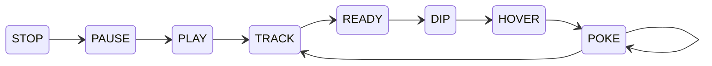

# Tech

technical description of tatbot

## URDF

tatbot is defined using URDF at `tatbot/assets/urdf/tatbot.urdf`.

## Setup

python dependencies are managed with environments using [`uv`](https://docs.astral.sh/uv/getting-started/installation/)

```bash
# Clean old uv environment
deactivate && \
rm -rf .venv && \
rm uv.lock
# Setup new uv environment
uv venv && \
source .venv/bin/activate && \
uv pip install -r pyproject.toml
```

keys, tokens, passwords are stored in the `.env` file.

```bash
source .env
```

## Run

1. flip power strip in the back to on.
2. press power button on `trossen-ai`, it will glow blue.
3. flip rocker switches to "on" on `arm-r` and `arm-l` control boxes underneath workspace.
4. flip rocker switch on the back of the light to turn it on.

```bash
uv run python tatbot.py
```

## States

tatbot operates using a state machine



## Devices

tatbot consists of several computers, cameras, and robotos connected via ethernet:

- `ojo`: NVIDIA Jetson AGX Orin (12-core ARM Cortex-A78AE @ 2.2 GHz) (32GB Unified RAM) (200 TOPS)
- `trossen-ai`: System76 Meerkat PC (13th Gen Intel i5-1340P, 16-core @ 4.6GHz) (15GB RAM)
- `rpi1`: Raspberry Pi 5 (4-core ARM Cortex-A76 @ 2.4 GHz) (8GB RAM)
- `rpi2`: Raspberry Pi 5 (4-core ARM Cortex-A76 @ 2.4 GHz) (8GB RAM)
- `camera1`: Amcrest PoE cameras (5MP)
- `camera2`: Amcrest PoE cameras (5MP)
- `camera3`: Amcrest PoE cameras (5MP)
- `camera4`: Amcrest PoE cameras (5MP)
- `camera5`: Amcrest PoE cameras (5MP)
- `camera-a`: Intel Realsense D405 (1280x720 RGBD, 90fps)
- `camera-b`: Intel Realsense D405 (1280x720 RGBD, 90fps)
- `switch-main`: 5-port gigabit ethernet switch
- `switch-poe`: 8-port gigabit PoE switch
- `arm-l`: Trossen Arm Controller box connected to WidowXAI arm
- `arm-r`: Trossen Arm Controller box connected to WidowXAI arm
- `oop`: (only used for development)

## Dependencies

tatbot makes use of the following dependencies:

- [`pyroki`](https://github.com/chungmin99/pyroki) - inverse kinematics
- [`viser`](https://github.com/nerfstudio-project/viser) - GUI
- [`librealsense`](https://github.com/IntelRealSense/librealsense) - depth cameras
- [`trossen_arm`](https://github.com/TrossenRobotics/trossen_arm) - robot arms
- [`jax`](https://github.com/jax-ml/jax) - gpu acceleration
- [`pupil-apriltags`](https://github.com/pupil-labs/apriltags) - object tracking

## Networking

- `switch-main`:
    - (1) short black ethernet cable to `switch-poe`
    - (2) short black ethernet cable to `trossen-ai`
    - (3) short black ethernet cable to `ojo`
    - (4) blue ethernet cable to `arm-r` controller box
    - (5) blue ethernet cable to `arm-l` controller box
- `switch-poe`:
    - (1) long black ethernet cable to `camera1`
    - (2) long black ethernet cable to `camera2`
    - (3) long black ethernet cable to `camera3`
    - (4) long black ethernet cable to `camera4`
    - (5) long black ethernet cable to `camera5`
    - (6) -
    - (7) short black ethernet cable to `rpi1`
    - (8) short black ethernet cable to `rpi2`
    - (uplink-1) -
    - (uplink-2) short black ethernet cable to `switch-main`

hardcoded ip addresses:

- `192.168.1.53` - `oop`
- `192.168.1.91` - `camera1`
- `192.168.1.92` - `camera2`
- `192.168.1.93` - `camera3`
- `192.168.1.94` - `camera4`
- `192.168.1.95` - `camera5`
- `192.168.1.96` - `ojo`
- `192.168.1.97` - `trossen-ai`
- `192.168.1.98` - `rpi1`
- `192.168.1.99` - `rpi2`

## Trossen Robot Arms

tatbot uses two [Trossen WidowXAI arms](https://docs.trossenrobotics.com/trossen_arm/main/specifications.html).

- [trossen_arm](ttps://github.com/TrossenRobotics/trossen_arm)
- [Driver API Documentation](https://docs.trossenrobotics.com/trossen_arm/main/api/library_root.html#)
- [official URDF](https://github.com/TrossenRobotics/trossen_arm_description)

```bash
uv run python config/trossen.py
```

## Realsense Cameras

tatbot uses two [D405 Intel Realsense cameras](https://www.intelrealsense.com/depth-camera-d405/).

- `camera-a` is connected to `trossen-ai` via usb3 port and attached to the end effector of `arm-r`
- `camera-b` is connected to `trossen-ai` via usb3 port and attached to alumnium frame, giving it an overhead view
- Follow the [calibration guide](https://dev.intelrealsense.com/docs/self-calibration-for-depth-cameras).
- Use the `rs-enumerate-devices` command to verify that both realsenses are connected. If this doesn't work, unplug and replug the realsense cameras.

## GPU

jax is used for gpu acceleration, to check if jax has access to gpu:

```bash
uv run python -c "import jax; has_gpu = bool(jax.devices('gpu')); print(has_gpu)"
```

## AprilTags

Objects (i.e. ink palette) in the scene are tracked using [AprilTags](https://chaitanyantr.github.io/apriltag.html).

## Profiling

TODO: none of these feel great...

### [snakeviz](https://github.com/jiffyclub/snakeviz)

```bash
uv pip install snakeviz
snakeviz tatbot.prof
```

### [scalene](https://github.com/plasma-umass/scalene)

```bash
uv pip install scalene
scalene --cpu --gpu --memory tatbot.py
```

### [nsys](https://docs.nvidia.com/nsight-systems/UserGuide/index.html)

```bash
nsys profile -t cuda,nvtx,osrt --stats=true -o tatbot uv run python tatbot.py --debug
nsys-ui tatbot.nsys-rep
```

### JAX profiler

```bash
uv run python tatbot.py 
tensorboard --logdir ./jax_trace
```